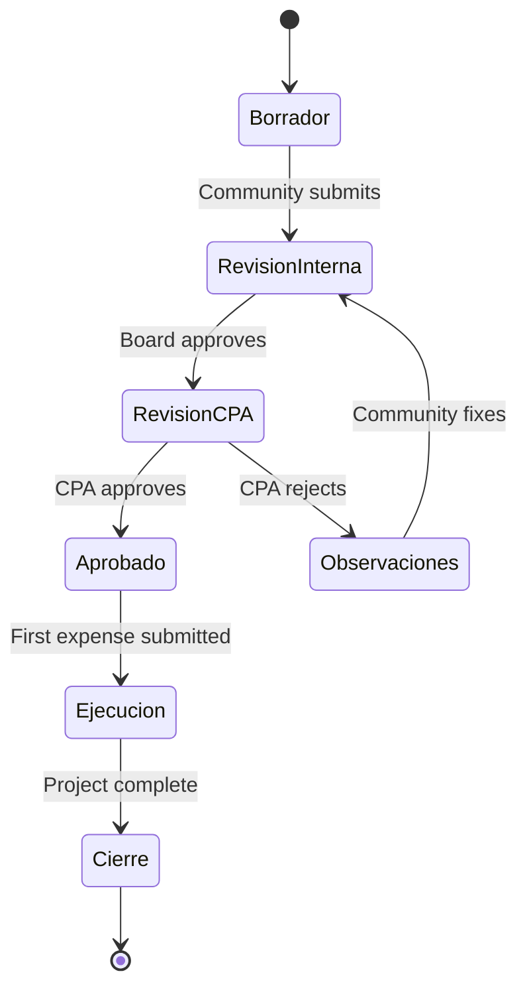
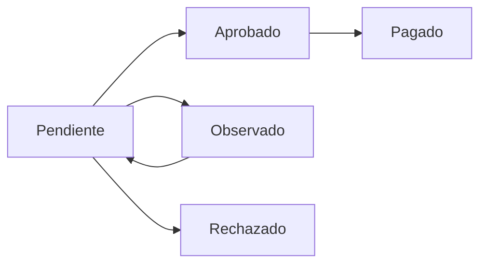

## Overview

Auditoriapp implements a comprehensive audit workflow that ensures financial accountability and compliance for community projects. The workflow involves multiple stakeholders and checkpoints from project inception to closure.

## Workflow Participants

<CardGroup cols={2}>
  <Card title="Community Board" icon="users">
    **Roles**: Presidente, Directorio
    
    Submit projects for review and manage internal approvals
  </Card>
  <Card title="CPA Reviewer" icon="certificate">
    **Role**: CPA
    
    External auditor who validates projects and expense reports
  </Card>
  <Card title="Technical Officer" icon="hard-hat">
    **Role**: ITO
    
    Reports physical progress and coordinates execution
  </Card>
  <Card title="System Admin" icon="crown">
    **Role**: Admin
    
    Manages users and can override workflow when needed
  </Card>
</CardGroup>

## Project Audit Flow

### Complete Workflow Diagram



### State Transition Details

<Steps>
  <Step title="Draft Creation">
    Community members create a project in **Borrador** state with:
    - Project objectives and justification
    - Estimated beneficiaries
    - Budget breakdown
    - Assembly meeting minutes (quorum)
    - President's digital signature
  </Step>
  
  <Step title="Internal Review">
    Community board moves project to **Revisión Interna** to:
    - Verify all required documentation
    - Validate budget calculations
    - Ensure community governance compliance
    - Prepare for external review
  </Step>
  
  <Step title="CPA Submission">
    Presidente or Directorio submits to **Revisión CPA**:
    ```python
    if request.user.rol not in ['presidente', 'directorio', 'admin']:
        return Response(
            {'error': 'Solo Presidente o Directorio pueden enviar a CPA'}, 
            status=status.HTTP_403_FORBIDDEN
        )
    ```
  </Step>
  
  <Step title="CPA Review">
    CPA reviewer examines the project and either:
    - **Approves**: Moves to **Aprobado** state
    - **Rejects**: Moves to **Observaciones** with comments
    
    ```python
    if nuevo_estado == 'aprobado':
        if request.user.rol != 'cpa':
            return Response(
                {'error': 'Solo el CPA puede aprobar proyectos'}, 
                status=status.HTTP_403_FORBIDDEN
            )
    ```
  </Step>
  
  <Step title="Address Observations">
    If observations exist, community fixes issues and resubmits:
    ```
    Observaciones → Revisión Interna → Revisión CPA
    ```
  </Step>
  
  <Step title="Execution">
    Approved projects automatically move to **Ejecución** when the first expense report is submitted:
    ```python
    if instance.pk and proyecto.estado == 'aprobado':
        proyecto.estado = 'ejecucion'
    ```
  </Step>
  
  <Step title="Closure">
    After all work is complete and expenses are settled, project moves to **Cierre**
  </Step>
</Steps>

## Expense Report Audit Flow

### Rendicion Review Process

Expense reports follow their own audit workflow:



### Review Implementation

```python
@action(detail=True, methods=['post'])
def revisar(self, request, pk=None):
    rendicion = self.get_object()
    user = request.user
    
    # Validate Role (Only CPA or Admin)
    if user.rol not in ['cpa', 'admin', 'CPA Revisor']:
        return Response(
            {'error': 'No tiene permisos para revisar'}, 
            status=403
        )

    nuevo_estado = request.data.get('estado')
    observacion = request.data.get('observacion', '')

    if nuevo_estado not in ['aprobado', 'observado', 'rechazado']:
        return Response({'error': 'Estado inválido'}, status=400)

    # Record the review
    rendicion.estado = nuevo_estado
    rendicion.observacion = observacion
    rendicion.revisor = user
    rendicion.fecha_revision = timezone.now()
    rendicion.save()

    return Response({'status': 'ok', 'estado': rendicion.estado})
```

### Review Criteria

CPAs evaluate expense reports based on:

<Accordion title="Documentation Completeness">
  - Invoice or receipt (numero_documento)
  - Supporting documentation (documentos_adjuntos)
  - Clear description of expense
  - Valid vendor information
</Accordion>

<Accordion title="Financial Validity">
  - Amount matches supporting documents
  - Expense aligns with approved project budget
  - No duplicate submissions
  - Proper accounting classification
</Accordion>

<Accordion title="Project Alignment">
  - Expense relates to approved project activities
  - Purchase necessary for project objectives
  - Timing appropriate for project phase
</Accordion>

<Accordion title="Compliance">
  - Follows procurement regulations
  - Tax documentation correct
  - Vendor authorized to provide services/goods
</Accordion>

## Audit Trail & History

### Project State History

Every state change is logged with full context:

```python
class HistorialEstado(models.Model):
    proyecto = models.ForeignKey(Proyecto, on_delete=models.CASCADE, 
                                 related_name='historial')
    estado_anterior = models.CharField(max_length=50, choices=ESTADO_CHOICES, 
                                       null=True, blank=True)
    estado_nuevo = models.CharField(max_length=50, choices=ESTADO_CHOICES)
    usuario = models.ForeignKey('usuarios.CustomUser', on_delete=models.SET_NULL, 
                                null=True)
    fecha = models.DateTimeField(auto_now_add=True)
    comentario = models.TextField(blank=True)
```

Creating history records:

```python
HistorialEstado.objects.create(
    proyecto=proyecto,
    estado_anterior=estado_anterior,
    estado_nuevo=nuevo_estado,
    usuario=request.user,
    comentario=comentario
)
```

### Expense Report Audit Fields

Rendiciones track review details:

```python
class Rendicion(models.Model):
    # Review audit fields
    estado = models.CharField(max_length=20, choices=ESTADO_RENDICION, 
                              default='pendiente')
    observacion = models.TextField(blank=True, null=True, 
                                    help_text="Observaciones del auditor/CPA")
    revisor = models.ForeignKey('usuarios.CustomUser', on_delete=models.SET_NULL, 
                                 null=True, blank=True, 
                                 related_name='rendiciones_revisadas')
    fecha_revision = models.DateTimeField(null=True, blank=True)
```

<Info>
**Audit Trail Benefits**: Complete tracking of who reviewed what, when, and why provides transparency and accountability required for public fund management.
</Info>

## Physical Progress Verification

### ITO Progress Reports

During execution, the ITO creates progress reports:

```python
class ReporteAvance(models.Model):
    proyecto = models.ForeignKey(Proyecto, on_delete=models.CASCADE, 
                                 related_name='reportes_avance')
    autor = models.ForeignKey('usuarios.CustomUser', on_delete=models.SET_NULL, 
                              null=True)
    fecha_reporte = models.DateField(auto_now_add=True)
    
    porcentaje_avance = models.PositiveIntegerField(
        help_text="Porcentaje de avance físico (0-100)"
    )
    observaciones = models.TextField()
    foto_avance = models.ImageField(upload_to='avances/', null=True, blank=True)
```

### Progress Verification Process

<Steps>
  <Step title="Site Visit">
    ITO visits project site and assesses physical progress
  </Step>
  <Step title="Photo Documentation">
    Takes photos showing current state of work
  </Step>
  <Step title="Report Submission">
    Submits report with percentage complete and observations
  </Step>
  <Step title="CPA Review">
    CPA can cross-reference physical progress with financial expenditures
  </Step>
</Steps>

## Compliance Checkpoints

### Before CPA Submission

<Checklist>
  <Check>Project has valid name and description</Check>
  <Check>Budget breakdown is complete</Check>
  <Check>Assembly quorum documented (quorum_asamblea > 0)</Check>
  <Check>President has signed digitally (firma_presidente = True)</Check>
  <Check>All required documents uploaded</Check>
  <Check>Beneficiary count estimated</Check>
</Checklist>

### Before Approval

<Checklist>
  <Check>Project aligns with community development plan</Check>
  <Check>Budget is realistic and justified</Check>
  <Check>Procurement plan is sound</Check>
  <Check>Timeline is achievable</Check>
  <Check>Governance requirements met</Check>
  <Check>Risk assessment completed</Check>
</Checklist>

### Before Payment

<Checklist>
  <Check>Expense report approved by CPA</Check>
  <Check>Supporting documents validated</Check>
  <Check>Budget availability confirmed</Check>
  <Check>Vendor information verified</Check>
  <Check>Physical progress aligns with expenses</Check>
</Checklist>

## Automated Validations

### State Transition Guards

The system enforces workflow rules automatically:

```python
# Can't approve unless in CPA review
if proyecto.estado != 'revision_cpa':
    return Response(
        {'error': 'El proyecto debe estar en revisión por el CPA para ser aprobado'}, 
        status=status.HTTP_400_BAD_REQUEST
    )

# Can't submit to CPA unless in internal review
if proyecto.estado != 'revision_interna':
    return Response(
        {'error': 'El proyecto debe haber pasado la revisión interna'}, 
        status=status.HTTP_400_BAD_REQUEST
    )
```

### Financial Validations

Automatic budget tracking prevents overspending:

```python
@receiver([post_save, post_delete], sender=Rendicion)
def actualizar_total_rendido_proyecto(sender, instance, **kwargs):
    proyecto = instance.proyecto
    
    total = Rendicion.objects.filter(proyecto=proyecto).aggregate(
        total_sum=Sum('monto_rendido')
    )['total_sum']
    
    proyecto.total_rendido = total or 0
    proyecto.save(update_fields=['total_rendido', 'estado'])
```

<Warning>
Always verify that `total_rendido` does not exceed `presupuesto_total` before approving expense reports.
</Warning>

## Reporting & Analytics

### Audit Dashboard Queries

<Tabs>
  <Tab title="Pending Reviews">
    ```python
    # Projects awaiting CPA review
    pending_projects = Proyecto.objects.filter(
        comunidad=user.comunidad,
        estado='revision_cpa'
    )
    
    # Expense reports awaiting review
    pending_rendiciones = Rendicion.objects.filter(
        proyecto__comunidad=user.comunidad,
        estado='pendiente'
    )
    ```
  </Tab>
  <Tab title="Review Statistics">
    ```python
    from django.db.models import Count, Avg
    
    # Average time to approve
    stats = Rendicion.objects.filter(
        estado='aprobado'
    ).aggregate(
        total=Count('id'),
        avg_days=Avg(
            F('fecha_revision') - F('fecha_rendicion')
        )
    )
    ```
  </Tab>
  <Tab title="Observation Tracking">
    ```python
    # Projects with unresolved observations
    with_observations = Proyecto.objects.filter(
        comunidad=user.comunidad,
        estado='observaciones'
    ).select_related('historial')
    ```
  </Tab>
</Tabs>

## Best Practices

<CardGroup cols={2}>
  <Card title="Timely Reviews" icon="clock">
    CPAs should review submissions within 5 business days
  </Card>
  <Card title="Clear Comments" icon="comment">
    Always provide specific, actionable observations
  </Card>
  <Card title="Documentation" icon="file-lines">
    Require complete documentation before approval
  </Card>
  <Card title="Progress Alignment" icon="chart-line">
    Verify financial progress matches physical progress
  </Card>
</CardGroup>

## Common Scenarios

### Scenario 1: Project with Observations

1. Community submits project for CPA review
2. CPA identifies missing documentation
3. CPA moves project to "Observaciones" with clear comments
4. Community addresses issues and uploads missing docs
5. Community resubmits to internal review, then back to CPA
6. CPA approves project

### Scenario 2: Expense Report Rejection

1. ITO submits expense report for materials
2. CPA notices invoice is from unauthorized vendor
3. CPA rejects with explanation
4. Community sources from approved vendor
5. New expense report submitted and approved

### Scenario 3: Automatic Execution Transition

1. Project approved by CPA (estado = 'aprobado')
2. ITO submits first expense report
3. Signal handler automatically transitions project to 'ejecucion'
4. CPA reviews and approves expense report
5. Physical progress reports begin

## Related Features

<CardGroup cols={2}>
  <Card title="Role-Based Access" icon="user-shield" href="/features/role-based-access">
    Understand who can perform each audit action
  </Card>
  <Card title="Financial Tracking" icon="dollar-sign" href="/features/financial-tracking">
    Learn about budget monitoring during audits
  </Card>
  <Card title="Document Management" icon="folder" href="/features/document-management">
    See how supporting documents are managed
  </Card>
</CardGroup>