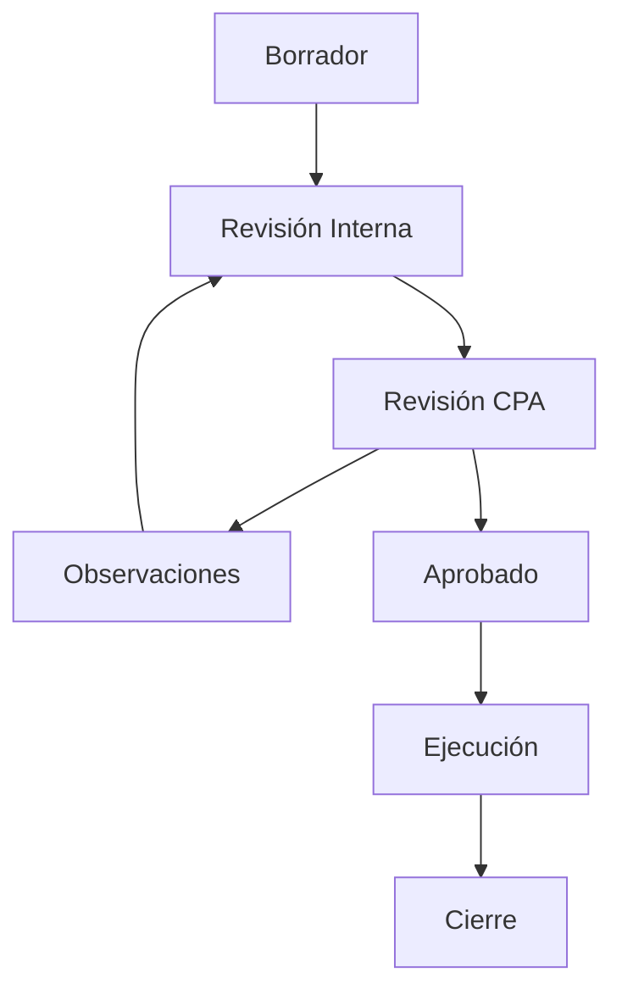

## Overview

Auditoriapp's project management system tracks community infrastructure projects from initial drafting through execution and closure. Projects follow a structured workflow with state transitions controlled by role-based permissions.

## Project Model

The core `Proyecto` model contains all project information:

```python
ESTADO_CHOICES = [
    ('borrador', 'Borrador'),
    ('revision_interna', 'En Revisión Interna'),
    ('revision_cpa', 'En Revisión CPA'),
    ('observaciones', 'Con Observaciones'),
    ('aprobado', 'Aprobado'),
    ('ejecucion', 'En Ejecución'),
    ('cierre', 'Cierre'),
]

class Proyecto(models.Model):
    comunidad = models.ForeignKey('comunidades.Comunidad', on_delete=models.CASCADE)
    periodo = models.ForeignKey('periodos.Periodo', on_delete=models.CASCADE)
    nombre = models.CharField(max_length=255)
    descripcion = models.TextField(default='') 
    fecha_inicio = models.DateField(null=True, blank=True) 
    fecha_fin = models.DateField(null=True, blank=True)
    presupuesto_total = models.DecimalField(max_digits=12, decimal_places=2, default=0) 
    
    estado = models.CharField(max_length=50, choices=ESTADO_CHOICES, default='borrador')
    total_rendido = models.DecimalField(max_digits=12, decimal_places=2, default=0)
    estado_rendicion = models.CharField(max_length=50, default='Pendiente')
    
    # Project formulation and governance
    objetivos = models.TextField(help_text="Objetivos principales del proyecto", blank=True, default='')
    justificacion = models.TextField(help_text="Por qué es necesario este proyecto", blank=True, default='')
    beneficiarios_estimados = models.PositiveIntegerField(help_text="Número de personas beneficiadas", default=0)

    # Governance (Assembly validation)
    quorum_asamblea = models.PositiveIntegerField(help_text="Número de asistentes en el Acta", default=0)
    
    # President signature (Legal representative)
    firma_presidente = models.BooleanField(default=False, help_text="Aprobación digital simple del Presidente")
    fecha_firma_presidente = models.DateTimeField(null=True, blank=True)

    def __str__(self):
        return self.nombre
```

## Project States

Projects progress through seven distinct states:

<Steps>
  <Step title="Borrador (Draft)">
    Initial state when a project is created. Community members can edit all details.
  </Step>
  <Step title="Revisión Interna (Internal Review)">
    Community board reviews the project before submitting to CPA.
  </Step>
  <Step title="Revisión CPA (CPA Review)">
    External CPA reviewer examines the project for compliance and feasibility.
  </Step>
  <Step title="Observaciones (With Observations)">
    CPA has identified issues that need to be addressed before approval.
  </Step>
  <Step title="Aprobado (Approved)">
    Project is approved and ready for execution.
  </Step>
  <Step title="Ejecución (In Execution)">
    Project is actively being implemented with expense reports being submitted.
  </Step>
  <Step title="Cierre (Closure)">
    Project is complete with final reports and documentation.
  </Step>
</Steps>

## State Transition Rules

### Visual Workflow



### Transition Authorization

Different roles control different transitions:

<Tabs>
  <Tab title="CPA Actions">
    ```python
    # Only CPA can approve projects
    if nuevo_estado == 'aprobado':
        if request.user.rol != 'cpa':
            return Response(
                {'error': 'Solo el CPA puede aprobar proyectos'}, 
                status=status.HTTP_403_FORBIDDEN
            )
        if proyecto.estado != 'revision_cpa':
            return Response(
                {'error': 'El proyecto debe estar en revisión por el CPA para ser aprobado'}, 
                status=status.HTTP_400_BAD_REQUEST
            )
    ```
  </Tab>
  <Tab title="Presidente/Directorio Actions">
    ```python
    # Presidente or Directorio can submit to CPA
    elif nuevo_estado == 'revision_cpa':
        if request.user.rol not in ['presidente', 'directorio', 'admin']:
            return Response(
                {'error': 'Solo Presidente o Directorio pueden enviar a CPA'}, 
                status=status.HTTP_403_FORBIDDEN
            )
        if proyecto.estado != 'revision_interna':
            return Response(
                {'error': 'El proyecto debe haber pasado la revisión interna'}, 
                status=status.HTTP_400_BAD_REQUEST
            )
    ```
  </Tab>
  <Tab title="CPA Observations">
    ```python
    # CPA can issue observations
    elif nuevo_estado == 'observaciones':
        if request.user.rol != 'cpa':
            return Response(
                {'error': 'Solo el CPA puede emitir observaciones'}, 
                status=status.HTTP_403_FORBIDDEN
            )
    ```
  </Tab>
</Tabs>

## State History Tracking

Every state change is logged in the `HistorialEstado` model:

```python
class HistorialEstado(models.Model):
    proyecto = models.ForeignKey(Proyecto, on_delete=models.CASCADE, related_name='historial')
    estado_anterior = models.CharField(max_length=50, choices=ESTADO_CHOICES, null=True, blank=True)
    estado_nuevo = models.CharField(max_length=50, choices=ESTADO_CHOICES)
    usuario = models.ForeignKey('usuarios.CustomUser', on_delete=models.SET_NULL, null=True)
    fecha = models.DateTimeField(auto_now_add=True)
    comentario = models.TextField(blank=True)

    def __str__(self):
        return f"{self.proyecto.nombre}: {self.estado_anterior} -> {self.estado_nuevo}"
```

When a state changes, the system creates a history record:

```python
HistorialEstado.objects.create(
    proyecto=proyecto,
    estado_anterior=estado_anterior,
    estado_nuevo=nuevo_estado,
    usuario=request.user,
    comentario=comentario
)
```

<Info>
The history tracking provides a complete audit trail showing who changed what and when, essential for accountability in public fund management.
</Info>

## Physical Progress Reporting

During execution, the ITO (Technical Officer) reports physical progress:

```python
class ReporteAvance(models.Model):
    proyecto = models.ForeignKey(Proyecto, on_delete=models.CASCADE, related_name='reportes_avance')
    autor = models.ForeignKey('usuarios.CustomUser', on_delete=models.SET_NULL, null=True)
    fecha_reporte = models.DateField(auto_now_add=True)
    
    porcentaje_avance = models.PositiveIntegerField(help_text="Porcentaje de avance físico (0-100)")
    observaciones = models.TextField()
    foto_avance = models.ImageField(upload_to='avances/', null=True, blank=True)

    def __str__(self):
        return f"Avance {self.porcentaje_avance}% - {self.proyecto.nombre}"
```

### Creating Progress Reports

Only ITO or Admin can create progress reports:

```python
class ReporteAvanceViewSet(viewsets.ModelViewSet):
    serializer_class = ReporteAvanceSerializer
    permission_classes = [IsAuthenticated]

    def get_queryset(self):
        user = self.request.user
        if hasattr(user, 'comunidad') and user.comunidad:
            return ReporteAvance.objects.filter(
                proyecto__comunidad=user.comunidad
            ).order_by('-fecha_reporte')
        return ReporteAvance.objects.none()

    def perform_create(self, serializer):
        if self.request.user.rol not in ['ito', 'admin']:
            raise serializers.ValidationError(
                "Solo el ITO o Admin pueden reportar avance físico."
            )
        serializer.save(autor=self.request.user)
```

## Period Management

Projects are organized into periods (typically fiscal years):

```python
class Periodo(models.Model):
    comunidad = models.ForeignKey(Comunidad, on_delete=models.CASCADE, 
                                   related_name='periodos', null=True, blank=True)
    nombre = models.CharField(max_length=255)
    fecha_inicio = models.DateField()
    fecha_fin = models.DateField()
    monto_asignado = models.DecimalField(max_digits=15, decimal_places=2, default=0)
    monto_anterior = models.DecimalField(max_digits=15, decimal_places=2, default=0)
    activo = models.BooleanField(default=True)

    def __str__(self):
        if self.comunidad and self.comunidad.nombre:
            return f"{self.nombre} ({self.comunidad.nombre})"
        return f"{self.nombre}"
```

### Getting Active Period

A custom manager method finds the current active period:

```python
class PeriodoManager(models.Manager):
    def periodo_actual(self, comunidad):
        hoy = timezone.now().date()
        return self.filter(
            comunidad=comunidad, 
            activo=True, 
            fecha_inicio__lte=hoy, 
            fecha_fin__gte=hoy
        ).order_by('-fecha_inicio').first()
```

## Project ViewSet

The main API endpoint for projects implements multi-tenant filtering:

```python
class ProyectoViewSet(viewsets.ModelViewSet):
    serializer_class = ProyectoSerializer
    permission_classes = [IsAuthenticated]
    
    def get_queryset(self):
        user = self.request.user
        if hasattr(user, 'comunidad') and user.comunidad:
            return Proyecto.objects.filter(comunidad=user.comunidad)
        return Proyecto.objects.none()
    
    def perform_create(self, serializer):
        if self.request.user.rol == 'Admin Comunidad':
            serializer.save(comunidad=self.request.user.comunidad)
        else:
            serializer.save()
```

## Automatic State Transitions

When the first expense report is submitted for an approved project, it automatically transitions to "Ejecución":

```python
# In rendiciones/signals.py
@receiver([post_save, post_delete], sender=Rendicion)
def actualizar_total_rendido_proyecto(sender, instance, **kwargs):
    proyecto = instance.proyecto
    
    # Update total amount rendered
    total = Rendicion.objects.filter(proyecto=proyecto).aggregate(
        total_sum=Sum('monto_rendido')
    )['total_sum']
    proyecto.total_rendido = total or 0
    
    # Auto-transition: If first rendition and project is approved, move to execution
    if instance.pk and proyecto.estado == 'aprobado':
        proyecto.estado = 'ejecucion'
    
    proyecto.save(update_fields=['total_rendido', 'estado'])
```

<Warning>
This automatic transition ensures that projects move to execution status as soon as work begins, maintaining accurate state tracking.
</Warning>

## API Endpoints

### List/Create Projects

```http
GET /api/proyectos/
POST /api/proyectos/
```

### Change Project State

```http
POST /api/proyectos/{id}/cambiar_estado/
```

**Request Body:**
```json
{
  "nuevo_estado": "revision_cpa",
  "comentario": "Proyecto listo para revisión externa"
}
```

### Create Progress Report

```http
POST /api/reportes-avance/
```

**Request Body:**
```json
{
  "proyecto": 1,
  "porcentaje_avance": 45,
  "observaciones": "Cimientos completados, iniciando estructura",
  "foto_avance": "<file upload>"
}
```

## Best Practices

<CardGroup cols={2}>
  <Card title="Complete Documentation" icon="file-lines">
    Require all governance documents before moving to internal review
  </Card>
  <Card title="Clear Comments" icon="comment">
    Always provide meaningful comments when changing project states
  </Card>
  <Card title="Regular Updates" icon="clock">
    ITO should report progress at consistent intervals (weekly/monthly)
  </Card>
  <Card title="Track Observations" icon="list-check">
    Maintain a checklist of CPA observations and mark them as resolved
  </Card>
</CardGroup>

## Related Features

<CardGroup cols={2}>
  <Card title="Financial Tracking" icon="dollar-sign" href="/features/financial-tracking">
    Learn how project budgets are tracked and monitored
  </Card>
  <Card title="Document Management" icon="folder" href="/features/document-management">
    Understand how project documents are organized
  </Card>
  <Card title="Audit Workflow" icon="clipboard-check" href="/features/audit-workflow">
    See how projects flow through the audit process
  </Card>
</CardGroup>