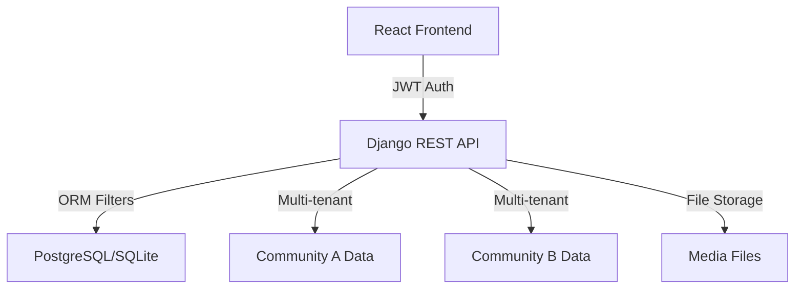

## What is Auditoriapp?

Auditoriapp is a **multi-tenant SaaS platform** designed to digitalize and streamline the audit, traceability, and transparent management of project funds for multiple beneficiary organizations. The system replaces manual, opaque workflows (Excel spreadsheets and PDFs) with a centralized digital solution that guarantees **data isolation** between communities and provides real-time oversight tools for auditors.

<Note>
Auditoriapp transforms manual fund management processes into a transparent, auditable, and efficient digital workflow with complete data isolation between organizations.
</Note>

## Key Features

<CardGroup cols={2}>
  <Card title="Multi-Tenant Architecture" icon="building">
    Logical data isolation ensuring each organization accesses only their own data through ORM-level filters
  </Card>
  
  <Card title="Role-Based Access Control" icon="shield">
    Granular permissions for Community Admins, Auditors, Presidents, Directors, and Technical Officers
  </Card>
  
  <Card title="Financial Traceability" icon="chart-line">
    Complete audit trail from budget allocation (Periods) to expense justification (Renditions)
  </Card>
  
  <Card title="Document Management" icon="file-check">
    Upload and validate supporting documents (PDFs, invoices, assembly minutes) for every transaction
  </Card>
</CardGroup>

## Core Capabilities

### For Community Organizations

- **Project Formulation**: Create projects with detailed proposals, objectives, and budget allocation
- **Assembly Governance**: Digital validation through quorum tracking and presidential signatures
- **Expense Tracking**: Submit expense reports (renditions) with supporting documentation
- **Real-time Dashboards**: Monitor budget execution, approved expenses, and project status

### For Auditors (CPA)

- **Cross-Organization Visibility**: View all communities' activities for validation and control
- **Approval Workflows**: Review and approve/reject projects and expense reports
- **Observation Management**: Add comments and request corrections before approval
- **Compliance Reporting**: Generate audit reports across all managed entities

## Architecture Overview

Auditoriapp uses a modern, scalable architecture:



### Technology Stack

**Backend**
- **Django 5.0.7** - Web framework
- **Django REST Framework 3.15** - API layer
- **SimpleJWT** - Token-based authentication
- **PostgreSQL/SQLite** - Database
- **Pillow** - Image processing

**Frontend**
- **React 19** - UI framework
- **Vite 7** - Build tool
- **TailwindCSS 4** - Styling
- **Recharts 3** - Data visualization
- **React Router 7** - Navigation

<Warning>
The system uses JWT authentication with a 60-minute access token lifetime. Ensure your frontend properly handles token refresh to avoid session interruptions.
</Warning>

## Multi-Tenant Data Isolation

Every Django model includes a `comunidad` (community) foreign key, and all API endpoints automatically filter by the authenticated user's community:

```python
# backend/proyectos/views.py
class ProyectoViewSet(viewsets.ModelViewSet):
    serializer_class = ProyectoSerializer
    permission_classes = [IsAuthenticated]
    
    def get_queryset(self):
        user = self.request.user
        if hasattr(user, 'comunidad') and user.comunidad:
            return Proyecto.objects.filter(comunidad=user.comunidad)
        return Proyecto.objects.none()
```

This ensures that:
- Community A can only see their own projects, expenses, and documents
- Auditors can override this filter to view all communities
- No cross-contamination of data between tenants

## User Roles

Auditoriapp implements 7 distinct user roles:

| Role | Code | Permissions |
|------|------|-------------|
| Admin | `admin` | Full community administration |
| Auditor | `auditor` | Cross-community visibility |
| Community President | `presidente` | Approve projects, sign documents |
| Community Director | `directorio` | Project oversight |
| Technical Officer (ITO) | `ito` | Report physical progress |
| CPA Reviewer | `cpa` | Approve/reject projects and renditions |
| User | `usuario` | Basic access |

```python
# backend/usuarios/models.py
class CustomUser(AbstractUser):
    comunidad = models.ForeignKey('comunidades.Comunidad', 
                                   on_delete=models.CASCADE, 
                                   null=True, blank=True)
    rol = models.CharField(max_length=20, choices=[
        ('admin', 'Admin'),
        ('auditor', 'Auditor'),
        ('usuario', 'Usuario'),
        ('directorio', 'Directorio Comunidad'),
        ('presidente', 'Presidente Comunidad'),
        ('ito', 'ITO / Responsable'),
        ('cpa', 'CPA Revisor')
    ], default='usuario')
    es_auditor = models.BooleanField(default=False)
```

## Project Lifecycle

Projects flow through a controlled workflow:

<Steps>
  <Step title="Draft (borrador)">
    Community creates project with basic information
  </Step>
  
  <Step title="Internal Review (revision_interna)">
    Community directors review proposal
  </Step>
  
  <Step title="CPA Review (revision_cpa)">
    Sent to external auditor for approval
  </Step>
  
  <Step title="Approved (aprobado)">
    CPA approves project for execution
  </Step>
  
  <Step title="Execution (ejecucion)">
    Project is active, expenses can be submitted
  </Step>
  
  <Step title="Closure (cierre)">
    Project completed and finalized
  </Step>
</Steps>

```python
# backend/proyectos/models.py
ESTADO_CHOICES = [
    ('borrador', 'Borrador'),
    ('revision_interna', 'En Revisión Interna'),
    ('revision_cpa', 'En Revisión CPA'),
    ('observaciones', 'Con Observaciones'),
    ('aprobado', 'Aprobado'),
    ('ejecucion', 'En Ejecución'),
    ('cierre', 'Cierre'),
]
```

## Dashboard & Analytics

Auditoriapp provides real-time KPIs and visualizations:

- **Total Projects**: Count of all projects in the community
- **Total Budget**: Sum of all project budgets
- **Amount Paid**: Total disbursed to vendors
- **Approved Renditions**: Validated expense reports
- **Execution Percentage**: (Paid / Budget) * 100

```python
# backend/dashboard/views.py
total_pagado = Rendicion.objects.filter(
    proyecto__comunidad=comunidad, 
    estado='pagado'
).aggregate(Sum('monto_rendido'))['monto_rendido__sum'] or 0

porcentaje_ejecucion = (total_pagado / presupuesto_total * 100) \
                       if presupuesto_total > 0 else 0
```

<Note>
All financial data is aggregated at the community level, with automatic filtering based on the authenticated user's organization.
</Note>

## Next Steps

<CardGroup cols={2}>
  <Card title="Quickstart Guide" icon="rocket" href="/quickstart">
    Get started with installation and your first project
  </Card>
  
  <Card title="Architecture Deep Dive" icon="diagram-project" href="/architecture">
    Understand the system's technical architecture
  </Card>
</CardGroup>